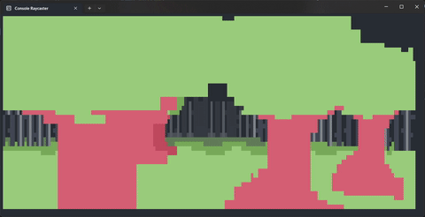

# ConsoleGame
I have started this project with no clear goal in mind. I was mainly inspired by javidx9's ["Code-It-Yourself! First Person Shooter"](https://www.youtube.com/watch?v=xW8skO7MFYw) tutorial and later by his ["Super Fast Ray Casting in Tiled Worlds using DDA"](https://www.youtube.com/watch?v=NbSee-XM7WA) tutorial and wanted to see if I could make sense of it myself, hence this project.

## What's the goal?
No idea! I don't even know what kind of game it is going to be. So far I am only laying the foundation for any game in general, and adding useful features along the way, so think of this as some primitive engine (if you could call it that, i have no idea how game engines work) to build game on top of. If this repo ever starts evolving towards some specific game, i will if course update this description.. 

**The main directives** 

I would however like to stick to a few things along the developement..
- Terminal as the graphical output.
  - That's what it's build for, and what I want it to remain as. It's not practical (at all), but it's a fun constraint and I want to see how far I could take this with.
- Other kinds of outputs besides visual are not out of the table and might be introduced later.
- Third party libraries may be utilized if necessary.

### Known issues:
- Keyboard input
  - ~~Input handler is very limited in it's current implementation. From the main game loop, a single key click is registered too many times.~~
  - ~~[Keyboard Repetition Delay](https://superuser.com/questions/1164303/windows-how-do-i-disable-the-keyboard-delay) also sucks, but that is apparently managed on OS level and couldn't be disabled programmatically without messing with windows registry.~~
  - As of 2025-12-17 update, the input is read directly from Windows, instead of the console window. The previous issues are resolved with this, but more arise;
    - It is now limited to Windows terminal only. Probably not an issue since this is a c# project.
    - Input is read even when terminal window is not in focus, so I have to figure out how to detect window focus.
- No collision checking implemented yet.
- Walking or looking out of bounds may cause a crash.
- Performance sucks mostly due to excessive writes to the console window. 

# Developement progress
## Major rewrite and update (2025-12-17)
- Massive rewrite and abstraction of everything!
- Colors!
- Textures from .png files!
- Billboards! Pillars! Almost any 2D shape imaginable! (from bird eye view)
- Custom floor and ceiling texture mapping! 
- Bunch of optimizations!
- Custom tool for debugging the raycasting engine using MonoGame library!
- Another TUI tool for debugging textures!
- Definitely a bunch of new bugs!

___
## Basic Ascii Art texture support (2025-01-20)
- Massive rewrite and expansion of Grid class (formerly Plane class).
- Added basic logic for rendering ascii art texture from a .txt file
- Fixed couple of perspective / visual glitches along the way.
	- Wall texture scales vertically correctly now when viewed from up close.
- Due to texture rendering implementation, darkening walls has been removed and will be reimplemented differently later.
- Added sky into the background :)

___
## Initial upload (2025-01-12)
- Added the initial version of the project.
- Loads an ASCII game map from a text file, initializes the player entity and renders it's POV through DDA raycasting.
- Contains a simple input handler for moving the player entity around the map, based on reading the console window input. 
- Renders the minimap on screen, with the player entity represented by a '☻', and the walls that are rendered by '#'.

___

